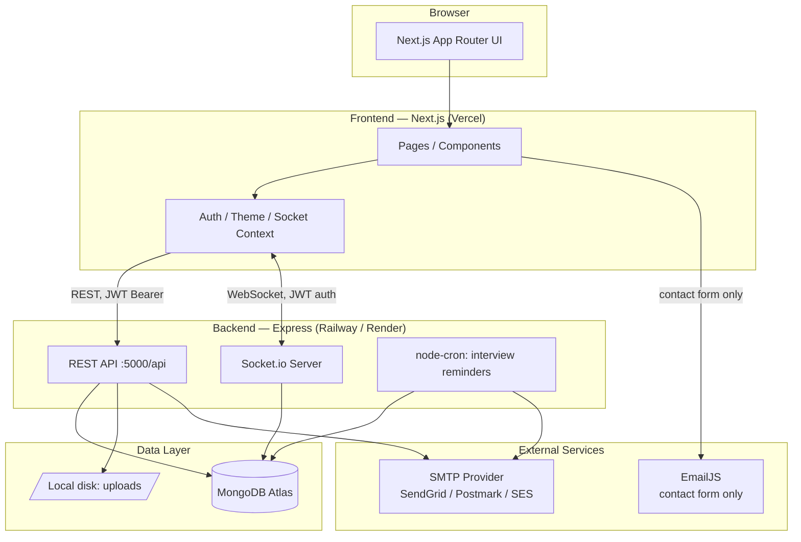
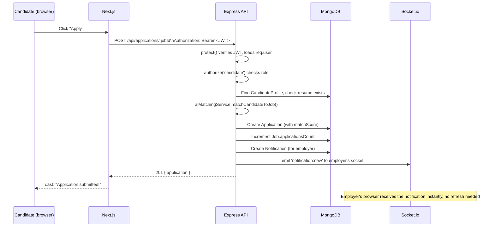
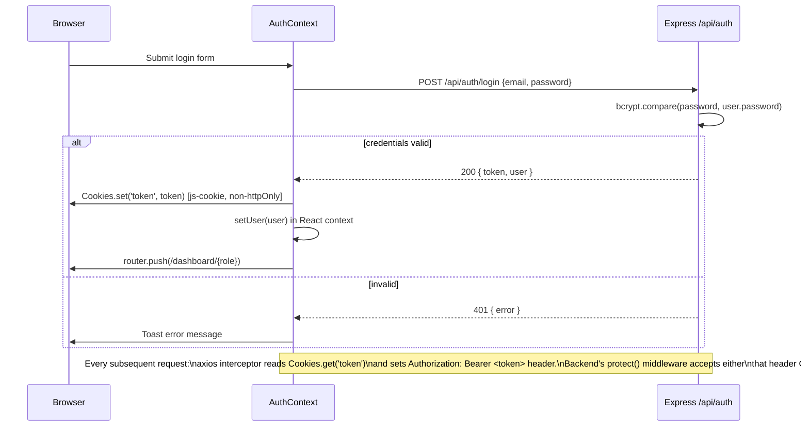
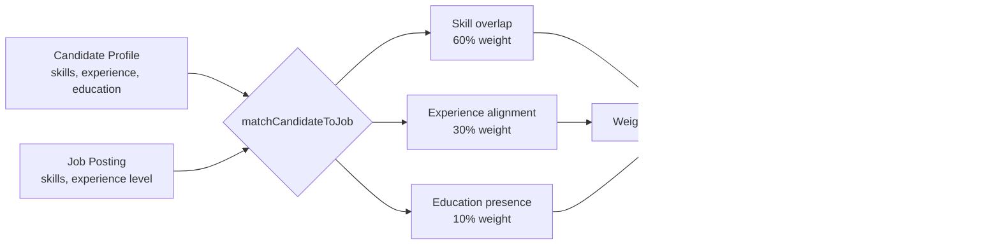
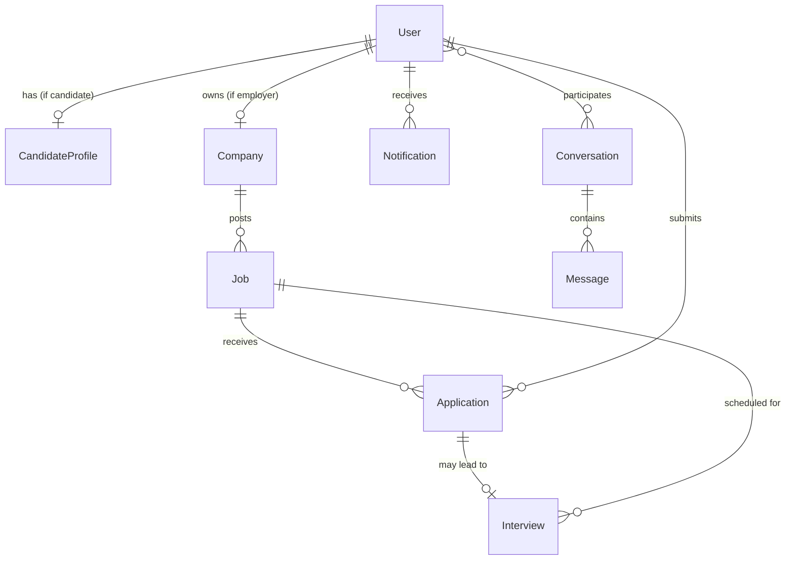

# CareerAI — Architecture

This document describes how the pieces of CareerAI fit together. Diagrams are
Mermaid — GitHub renders them natively when viewing this file in a browser;
most editors (VS Code with the Mermaid extension) render them too.

## 1. System overview



**Why two different email paths?** The contact form is a public, unauthenticated
page — EmailJS's client-side widget is fine there since there's nothing
sensitive in a "get in touch" message. Interview invitations, rejections, and
reminders contain information tied to a specific person's job application, so
those go through server-side SMTP (`backend/services/emailService.js`)
instead of a client-exposed API key.

## 2. Request flow — authenticated action

Example: a candidate applying to a job.



## 3. Authentication flow



A deliberate choice worth flagging: the JWT is stored in a **regular
(non-httpOnly) cookie** managed by `js-cookie` on the client, read explicitly
into an `Authorization` header on every request — not relied upon as an
ambient cookie sent automatically cross-origin. This sidesteps SameSite
cross-origin cookie restrictions between the Vercel-hosted frontend and the
Railway/Render-hosted backend, at the cost of the token being readable by any
JS running on the page (i.e. it does not protect against XSS the way a true
httpOnly cookie would). The backend's `helmet()` + `xss-clean()` middleware
reduce that risk but don't eliminate it — this is a real trade-off, not an
oversight.

## 4. AI matching engine

Pure, deterministic, no external API call — see
`backend/services/aiMatchingService.js`.



Because it's rules-based rather than an LLM call, a match score is always
explainable (you can point to exactly which skills were matched/missing) and
never varies between two runs on the same input — a real trade-off against an
LLM-based matcher that could catch semantic near-matches ("Node" vs
"Node.js") but would cost latency, money, and determinism.

## 5. Real-time notification delivery

```mermaid
flowchart LR
    Action[Any triggering action\ne.g. status change] --> NS[notificationService.sendNotification]
    NS --> DB[(Write to Notification collection)]
    NS --> Lookup{User connected\nright now?}
    Lookup -->|yes| Emit[io.to(socketId).emit\n'notification:new']
    Lookup -->|no| Skip[Skip emit —\nuser sees it on next login\nvia GET /api/notifications]
    Emit --> Client[Browser: NotificationBell\nupdates instantly, toast fires]
```

The Socket.io user→socket mapping (`backend/socket/index.js`) is an in-memory
`Map`, which is fine for a single backend instance. Scaling to multiple
backend instances horizontally would need this backed by Redis pub/sub
instead — noted here because it's a real limit of the current design, not
because it's built.

## 6. Data model relationships



## 7. Folder structure

```
job-portal/
├── backend/
│   ├── config/          # DB connection, email transport, constants
│   ├── controllers/      # request handlers — business logic lives here
│   ├── middleware/       # auth, validation, rate limiting, upload, errors
│   ├── models/           # Mongoose schemas
│   ├── routes/           # thin route → controller wiring
│   ├── services/         # AI matching, notifications, email, cron
│   ├── socket/            # Socket.io server + auth
│   ├── tests/             # Jest + Supertest + mongodb-memory-server
│   └── utils/             # validators, ICS generator, email templates
├── frontend/
│   ├── app/               # Next.js App Router — one folder per route
│   ├── components/        # ui/ (generic) · layout/ · dashboard/ · jobs/
│   ├── context/            # Auth, Theme, Socket React contexts
│   ├── services/           # typed API client functions, one per resource
│   ├── types/               # shared TypeScript interfaces
│   └── __tests__/           # Jest + React Testing Library
└── .github/workflows/       # CI (test/lint/build) + CD (deploy hooks)
```

## 8. Known limitations (honest, not aspirational)

- Socket user registry is in-memory — see §5, doesn't survive a backend
  restart or scale past one instance without a Redis layer.
- File uploads (resumes, avatars, logos) are stored on local disk
  (`backend/uploads/`), not object storage — on Railway/Render this disk is
  **ephemeral** and wiped on redeploy. For production, swap
  `middleware/upload.js` to stream to S3/Cloudinary/R2 instead of
  `multer.diskStorage`.
- The JWT lives in a non-httpOnly cookie — see §3's trade-off note.
- No caching layer (Redis, CDN edge caching for API responses) — every
  request hits MongoDB directly. Fine at current scale; would need
  revisiting under real load.
